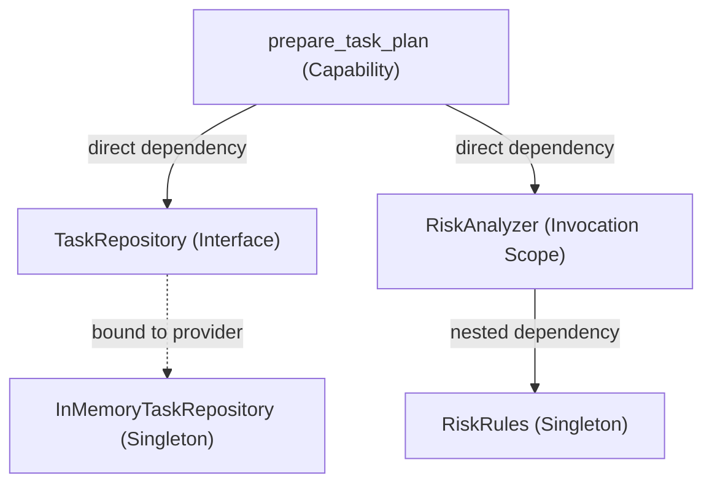
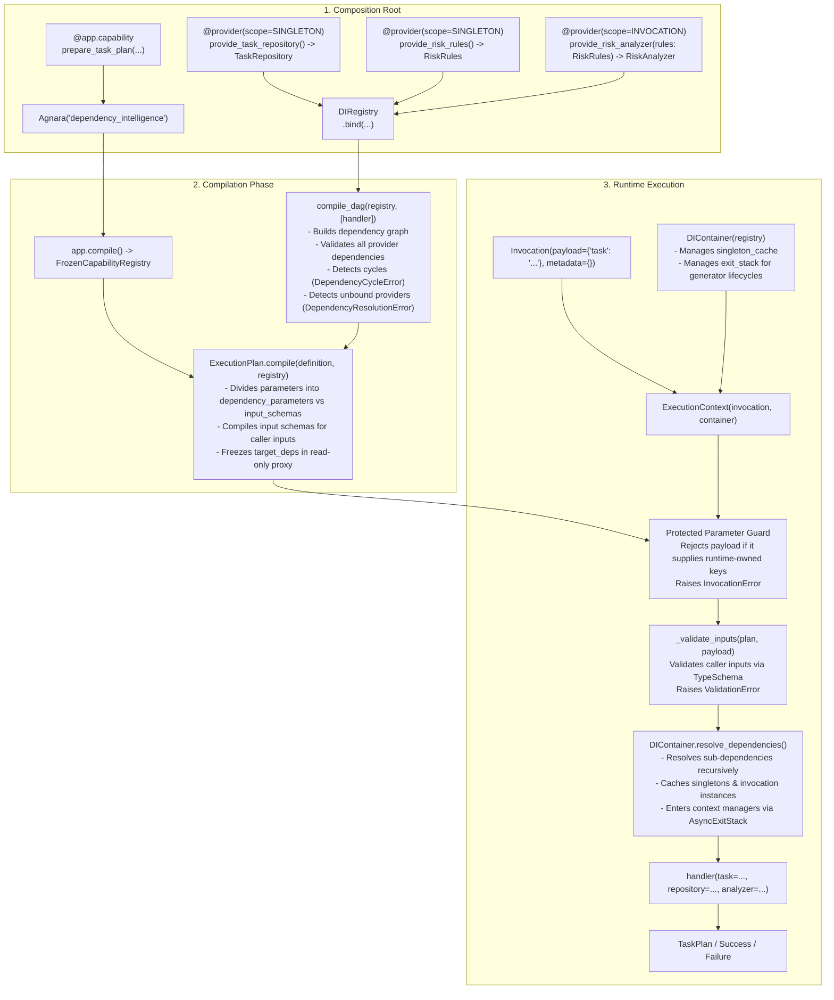

# Architecture: Agnara Dependency Intelligence

This document specifies the technical architecture of **Agnara Historical Reference Application #002**, focusing on the Dependency Injection (DI) kernel and runtime-owned parameter resolution in `agnara==0.1.0a2`.

---

## 1. Core Architectural Separation

Agnara establishes a strict structural boundary between **caller-owned capability inputs** and **runtime-owned dependencies**:

```text
Capability Signature:

prepare_task_plan(
    task: str,
    repository: TaskRepository,
    analyzer: RiskAnalyzer,
)

      │
      ├───────────────────────┬───────────────────────┐
      ▼                                               ▼
Caller-Owned Input                              Runtime-Owned Dependencies
--------------------                            --------------------------
Parameter: task: str                            Parameters: repository, analyzer
Supplied in: Invocation.payload                 Resolved by: DIContainer
Validated by: StandardSchemaAdapter             Provided by: DIRegistry providers
Controlled by: The caller                       Controlled by: The execution runtime
```

### The Invariant

- **The caller must never instantiate runtime dependencies.**
- **The caller must never place runtime dependencies into `Invocation.payload`.**
- If a caller supplies a parameter that Agnara recognizes as runtime-owned, the runtime terminates the request immediately with an `InvocationError`.

---

## 2. Dependency Graph Structure

The application builds a 2-level dependency graph showcasing abstraction binding, nested dependencies, and scope lifetimes:



### Dependency Roles

| Type | Implementation | Injected Into | Scope | Purpose |
| :--- | :--- | :--- | :--- | :--- |
| `TaskRepository` | `InMemoryTaskRepository` | `prepare_task_plan` | `SINGLETON` | Retrieves historical completed tasks matching description keywords. |
| `RiskRules` | `RiskRules` | `RiskAnalyzer` | `SINGLETON` | Evaluates critical markers and complexity scores. |
| `RiskAnalyzer` | `RiskAnalyzer` | `prepare_task_plan` | `INVOCATION` | Computes a task's `RiskAssessment` using injected rules. |

---

## 3. Execution Pipeline



---

## 4. Phase-by-Phase Mechanics

### Phase 1: Provider Declaration & Registration

Providers are declared using the `@provider` decorator from `agnara.core.di`:

```python
@provider(scope=Scope.SINGLETON)
def provide_task_repository() -> TaskRepository:
    return InMemoryTaskRepository()


@provider(scope=Scope.INVOCATION)
def provide_risk_analyzer(rules: RiskRules) -> RiskAnalyzer:
    return RiskAnalyzer(rules)
```

The decorator returns an immutable `ProviderDefinition` dataclass carrying:
- `func`: The factory callable.
- `scope`: `Scope.SINGLETON` or `Scope.INVOCATION`.
- `provider_type`: `SYNC_FUNCTION`, `ASYNC_FUNCTION`, `SYNC_GENERATOR`, or `ASYNC_GENERATOR`.
- `return_type`: The declared return type annotation.

The providers are registered in a `DIRegistry`:

```python
registry = DIRegistry()
registry.bind(TaskRepository, provide_task_repository)
registry.bind(RiskRules, provide_risk_rules)
registry.bind(RiskAnalyzer, provide_risk_analyzer)
```

### Phase 2: Static Graph Compilation (`ExecutionPlan.compile`)

When `ExecutionPlan.compile(definition, registry)` runs:

1. **DAG Analysis (`compile_dag`):**
   - Inspects handler parameter annotations via `get_type_hints(handler)`.
   - Filters annotations bound in `DIRegistry`.
   - Explores provider sub-dependencies recursively.
   - If any provider requires an unbound parameter: raises `DependencyResolutionError`.
   - If any cycle is detected: raises `DependencyCycleError`.
2. **Parameter Classification:**
   - `plan.dependency_parameters`: Parameters satisfied by `DIRegistry`.
   - `plan.context_parameters`: Parameters annotated with `ExecutionContext`.
   - `plan.protected_parameters`: Union of dependency and context parameters.
   - `plan.input_schemas`: Caller inputs compiled through `SchemaAdapter` (defaulting to `StandardSchemaAdapter`).
   - `plan.required_inputs`: Caller inputs without default values.

### Phase 3: Runtime Resolution (`DIContainer`)

During invocation (`invoke` or `invoke_result`):

1. **Protected Parameter Guard:**
   ```python
   supplied_protected = plan.protected_parameters.intersection(invocation.payload)
   if supplied_protected:
       raise InvocationError(
           f"invocation payload supplies runtime-owned parameter(s): {', '.join(sorted(supplied_protected))}"
       )
   ```
2. **Caller Input Validation:**
   Validates `invocation.payload` against compiled `input_schemas`. Rejects missing required fields, unexpected fields, and type mismatches (`ValidationError`).
3. **Dependency Resolution:**
   `DIContainer.resolve_dependencies(handler, target_deps)` resolves dependencies:
   - Reuses cached instances for `Scope.SINGLETON`.
   - Reuses instances within the invocation for `Scope.INVOCATION`.
   - Instantiates missing instances, resolving sub-dependencies first.
   - Yields a dictionary of kwargs which are passed into `handler(**arguments)`.

---

## 5. Scope Lifecycles and Container Management

| Scope | Cache Storage | Lifetime | Cleanup |
| :--- | :--- | :--- | :--- |
| `Scope.SINGLETON` | `container.singleton_cache` | Spans all invocations until `container.aclose()` | Global `container.exit_stack` |
| `Scope.INVOCATION` | `invocation_cache` | Local to a single capability execution | Local `invocation_stack` via `AsyncExitStack` |

---

## 6. Error Topology

| Error Class | Origin Phase | Cause | Handled As |
| :--- | :--- | :--- | :--- |
| `SchemaError` | Compilation | Capability parameter not registered in DI and rejected by `SchemaAdapter` | Unhandled compilation exception |
| `DependencyResolutionError` | Compilation | Provider requires an unbound sub-dependency | Unhandled compilation exception |
| `DependencyCycleError` | Compilation | Providers form a circular dependency | Unhandled compilation exception |
| `InvocationError` | Runtime Start | Caller passes runtime-owned parameter in payload | Direct exception in `invoke()`; `INTERNAL_FAILURE` in `invoke_result()` |
| `ValidationError` | Runtime Start | Missing, unexpected, or wrong-type caller input | Direct exception in `invoke()`; `INVALID_INPUT` with `details.path` in `invoke_result()` |
