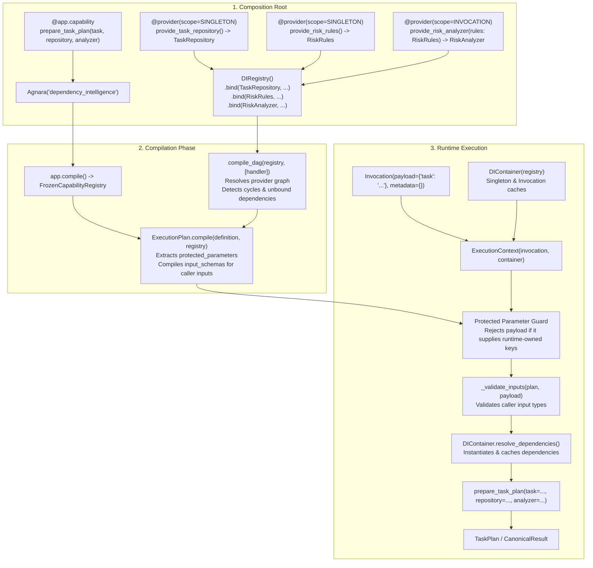

# Agnara Dependency Intelligence

> **Agnara Historical Reference Application #002**
> Demonstrating runtime-owned dependency injection, provider registration, compile-time DAG compilation, and caller parameter isolation with `agnara==0.1.0a2` on Python 3.14+.

[](https://github.com/agnara-project/agnara-dependency-intelligence/actions/workflows/ci.yml)
[](https://www.python.org/downloads/)
[](https://pypi.org/project/agnara/)
[](LICENSE)

---

## 5-Minute Overview

### What is Agnara Dependency Intelligence?
**Agnara Dependency Intelligence** is a software-task planning reference application designed to teach the dependency-injection model of the Agnara capability framework. It illustrates how a capability accepts business input from a caller while receiving underlying repositories and analyzers directly from the runtime.

### Why is it Historical Reference Application #002?
In the Agnara ecosystem curriculum, reference applications form a structured learning progression:

1. [**#001 — Agnara Task Intelligence**](https://github.com/agnara-project/agnara-task-intelligence): Capabilities, schema inference, execution plans, direct invocation, and input validation.
2. **#002 — Agnara Dependency Intelligence** *(this repository)*: Separating public caller inputs from runtime-owned dependencies, provider registration (`@provider`), registry binding (`DIRegistry`), static graph compilation (`ExecutionPlan.compile`), and container resolution (`DIContainer`).
3. **#003 — Agnara Secure Operations**: Scopes, principals, risk governance, interactive policies, and execution confirmation.

### What should I learn from #001 first?
From **#001**, you learned how capabilities declare schemas, how `ExecutionPlan` compiles input validation, and how invocations return canonical `Success` and `Failure` values. **#002** builds directly on this foundation by introducing **runtime-owned dependencies** into the capability signature.

### What is dependency injection here?
In Agnara, dependency injection separates caller-owned business input from runtime-owned dependencies. The compiled execution plan identifies dependency-backed parameters as protected runtime parameters, so callers provide business payload data while the runtime resolves registered dependencies. In `agnara==0.1.0a2`, supplying a protected runtime-owned parameter through `Invocation.payload` is rejected before the capability handler executes.

### What does the caller provide?
The caller provides **only business data** via `Invocation.payload`. In our primary capability:
```python
payload = {"task": "Add OAuth login to the admin portal"}
```

### What does Agnara provide?
Agnara automatically resolves and injects runtime-owned dependencies into the capability handler:
- `repository: TaskRepository` (bound to `InMemoryTaskRepository`)
- `analyzer: RiskAnalyzer` (configured with `RiskRules`)

The caller never instantiates these dependencies. Attempts to supply protected runtime-owned parameters through `Invocation.payload` are rejected.

### What is a provider?
A provider is a factory function decorated with `@provider(scope=...)` from `agnara.core.di`. It defines how to instantiate a dependency and assigns it a lifecycle scope (`Scope.SINGLETON` or `Scope.INVOCATION`).

### What is `DIRegistry`?
`DIRegistry` is the registry that maps abstraction types (e.g. `TaskRepository`) to their corresponding `ProviderDefinition`.

### When is `ExecutionPlan` compiled?
`ExecutionPlan.compile(definition, registry)` compiles the dependency graph **ahead of invocation time**. It performs cycle detection (`compile_dag`), verifies that all provider parameters can be resolved, divides handler parameters into `protected_parameters` vs `input_schemas`, and compiles input schemas for the caller-owned parameters.

### What happens when a provider is missing?
- If a capability handler parameter is not bound in `DIRegistry`, Agnara assumes it is a caller input; when compiling schemas, `StandardSchemaAdapter` rejects the custom interface and raises a compile-time `SchemaError`.
- If a provider requires an argument that is not registered, `compile_dag` immediately raises `DependencyResolutionError` at compilation time.
- If a caller attempts to supply a runtime-owned parameter inside `Invocation.payload`, Agnara detects a protected parameter violation and raises `InvocationError` before the handler is ever invoked.

### Why is Agnara pinned to `0.1.0a2`?
This repository is a **frozen historical reference application**. It demonstrates what was possible using the public `agnara==0.1.0a2` release published on PyPI. It will not be upgraded to newer framework releases, preserving an accurate historical artifact.

---

## Architectural Separation

```python
def prepare_task_plan(
    task: str,
    repository: TaskRepository,
    analyzer: RiskAnalyzer,
) -> TaskPlan: ...
```

| Parameter | Ownership | Origin | Validation / Resolution |
| :--- | :--- | :--- | :--- |
| `task: str` | **Caller-Owned** | `Invocation.payload["task"]` | Validated by `StandardSchemaAdapter` |
| `repository: TaskRepository` | **Runtime-Owned** | Injected via `DIRegistry` | Provided by `provide_task_repository` (Singleton) |
| `analyzer: RiskAnalyzer` | **Runtime-Owned** | Injected via `DIRegistry` | Provided by `provide_risk_analyzer` (Invocation Scope) |

---

## Execution Flow



---

## Getting Started

### Prerequisites
- CPython 3.14 or newer.
- Git.

### Setup on Linux / macOS
```bash
git clone https://github.com/agnara-project/agnara-dependency-intelligence.git
cd agnara-dependency-intelligence

python3.14 -m venv .venv
source .venv/bin/activate

pip install -r requirements.txt
pip install pytest>=9.0.0 ruff>=0.16.0
```

### Setup on Windows
```bat
git clone https://github.com/agnara-project/agnara-dependency-intelligence.git
cd agnara-dependency-intelligence

py -3.14 -m venv .venv
.venv\Scripts\activate

pip install -r requirements.txt
pip install pytest>=9.0.0 ruff>=0.16.0
```

---

## Running the Application

Execute the reference scenarios directly:

```bash
python app.py
```

### Expected Output

```text
=== Agnara Historical Reference Application #002 ===
Topic: Dependency Injection & Runtime-Owned Dependencies
Target Framework: agnara==0.1.0a2 (Python >=3.14)

[Compilation Inspection]
Capability ID:        dependency_intelligence.prepare_task_plan
Direct dependencies:  ['TaskRepository', 'RiskAnalyzer']
Protected parameters: ['analyzer', 'repository']
Required inputs:      ['task']
Input schemas:        ['task']

[Scenario A] Input: 'Add OAuth login to the admin portal'
  Complexity:       medium
  Risk:             medium
  Estimated steps:  4
  Requires review:  False
  Related tasks:    ['HT-101', 'HT-102']
  Recommendation:   Follow standard authentication integration guidelines.

[Scenario B] Input: 'Replace production authentication and migrate customer credentials'
  Complexity:       high
  Risk:             critical
  Estimated steps:  8
  Requires review:  True
  Related tasks:    ['HT-101', 'HT-102', 'HT-103', 'HT-105']
  Recommendation:   Requires multi-party review and staged migration window.

[Security/Integrity Demonstration: Rejected Runtime-Owned Parameter]
  Rejected as expected: invocation payload supplies runtime-owned parameter(s): repository

[Schema Validation Demonstration: Invalid Caller Input]
  Canonical Failure Code:    invalid_input
  Canonical Failure Message: expected str, got int
  Error Path Details:        {'path': ('task',)}

All demonstration scenarios executed successfully.
```

---

## Running Tests

Execute the full test suite with pytest:

```bash
python -m pytest tests/ -v
```

All 24 tests verify domain rules, provider decorators, registry bindings, compile-time DAG validation, cycle detection, scope caching, and payload isolation.

---

## Code Quality

Check formatting and linting with Ruff:

```bash
ruff format --check .
ruff check .
```

---

## Documentation Index

- [**Architecture Specification**](ARCHITECTURE.md): Full execution pipeline and design principles.
- [**Dependency Injection Deep Dive**](docs/dependency-injection.md): In-depth guide to providers, scopes, registries, and resolution.
- [**Capability Specification**](docs/capabilities.md): Formal definition of `prepare_task_plan`.
- [**Development Guide**](docs/development.md): Environment setup, tools, and workflows.
- [**Historical Context & Baseline**](docs/history.md): Positioning within the Agnara roadmap.
- [**Testing Strategy**](docs/testing.md): Overview of invariants and test coverage.
- [**Agent Handbook**](AGENTS.md): Instructions for AI coding assistants and agents.

---

## Historical Scope

This repository intentionally preserves the **Agnara `0.1.0a2`** dependency-injection baseline.

Its purpose is to demonstrate the separation between caller-owned capability inputs and runtime-owned dependencies, provider registration, dependency graph compilation, and dependency resolution.

It is not intended to evolve into a showcase of every future Agnara capability. More advanced execution-governance concepts are demonstrated by subsequent Historical Reference Applications.

---

## Limitations of the 0.1.0a2 Baseline

1. **Exact-Type Matching:** `DIRegistry` binds providers to exact Python types (`dict[type, ProviderDefinition]`). Subtype or protocol resolution is resolved through explicit registration.
2. **Provider Direct Payloads Prohibited:** Providers cannot accept request payloads directly; all provider arguments must themselves be bound providers in `DIRegistry`.
3. **Transport-Neutral In-Memory:** As an execution kernel proof-of-concept, `0.1.0a2` excludes network transport adapters (HTTP, MCP), which reside in future ecosystem layers.

---

## License

This project is licensed under the **Apache-2.0** License. See [LICENSE](LICENSE) for details.